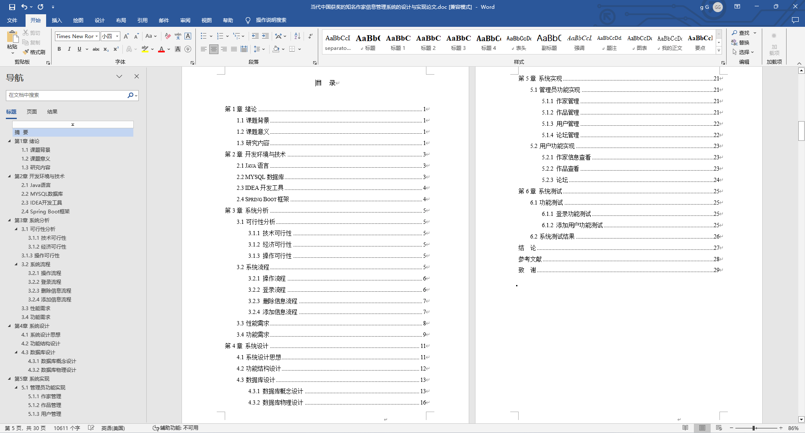
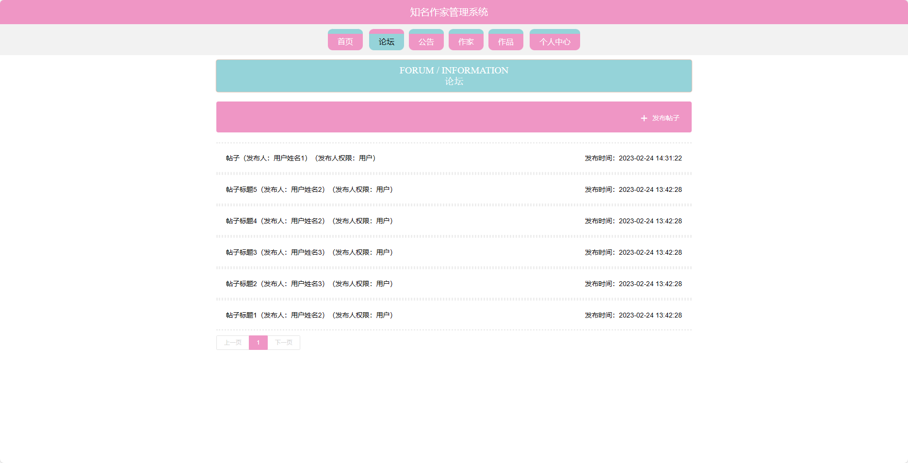
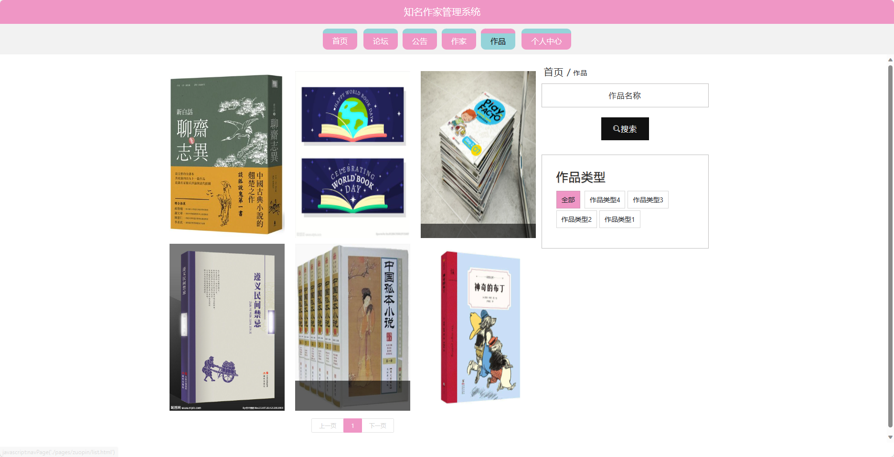
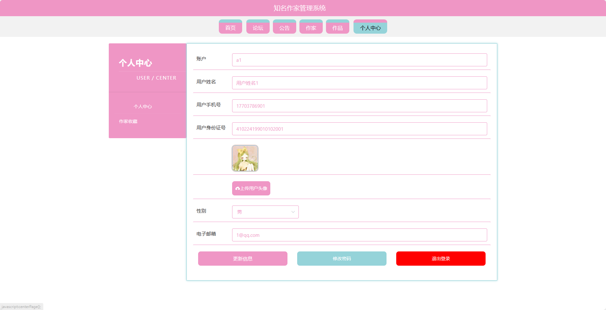
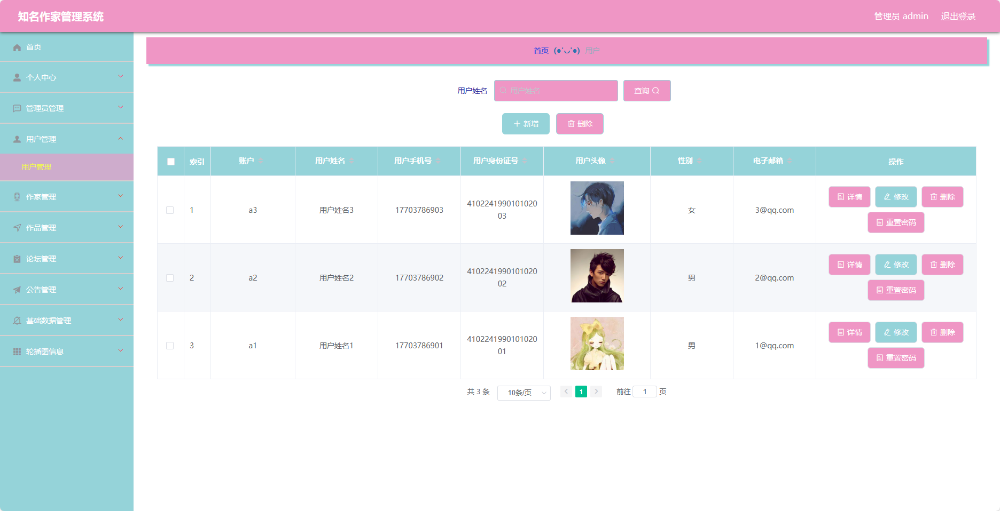

基于SpringBoot的当代中国获奖的知名作家信息管理系统（程序+论文）
=
- 完整代码获取地址：从戎源码网 ([https://armycodes.com/](https://armycodes.com/))
- 作者微信：19941326836  QQ：952045282 
- 承接计算机毕业设计、Java毕业设计、Python毕业设计、深度学习、机器学习
- 选题+开题报告+任务书+程序定制+安装调试+论文+答辩ppt 一条龙服务
- 所有选题地址https://github.com/nature924/allProject

一、项目介绍
---
基于Spring Boot框架实现的当代中国获奖的知名作家信息管理系统，系统包含两种角色：管理员、用户,系统分为前台和后台两大模块，主要功能如下。

### 前台功能：
- 首页：展示平台的概况、热门作家和作品等内容。
- 论坛：提供用户进行讨论和交流的平台。
- 公告：展示平台的最新公告和通知。
- 作家：展示当代中国获奖的知名作家的个人信息和作品列表。
- 作品：展示各位作家的作品信息和评论。
- 个人中心：用户可以管理个人信息、查看已发布的帖子、收藏作品等。

### 后台功能：
### 管理员：
- 个人中心：管理个人信息和账户。
- 管理员管理：管理系统管理员账号，包括新增、编辑、删除管理员账号。
- 用户管理：管理用户账号，包括查看用户列表、禁用用户账号等操作。
- 作家管理：管理知名作家的信息，包括新增、编辑、删除作家信息。
- 作品管理：管理作家的作品信息，包括新增、编辑、删除作品信息。
- 论坛管理：管理论坛的帖子和评论，包括审核、删除帖子和评论等操作。
- 公告管理：管理平台的公告和通知，包括发布、编辑、删除公告等操作。
- 基础数据管理：管理系统的基础数据，例如作家类型、作品分类等信息。
- 轮播图管理：管理首页轮播图的展示，包括新增、编辑、删除轮播图信息。

二、项目技术
---
- 编程语言：Java
- 数据库：MySQL
- 项目管理工具：Maven
- 前端技术：VUE、HTML、Jquery、Bootstrap
- 后端技术：Spring、SpringMVC、MyBatis

三、运行环境
---
- 操作系统：Windows、macOS都可以
- JDK版本：JDK1.8以上都可以
- 开发工具：IDEA、Ecplise、Myecplise都可以
- 数据库: MySQL5.7以上都可以
- Tomcat：任意版本都可以
- Maven：任意版本都可以

四、运行截图
---
### 论文截图：

### 程序截图：

